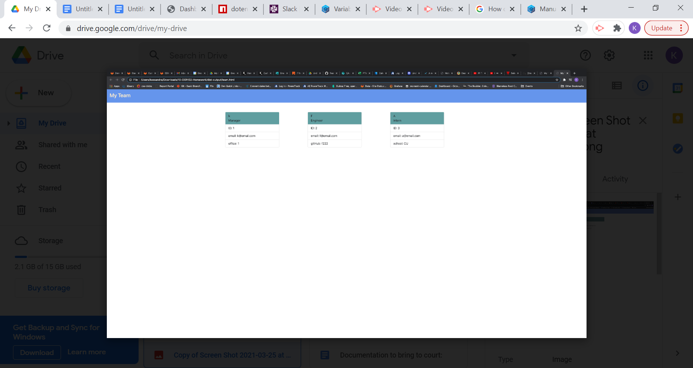

## MyTeam app: Team Profile Generator

## Description
This is a Node.js command-line application that takes in information about employees on a software engineering team(manager, engineer, intern), through a series of questions - with some specific to each employee type - and then generates an HTML webpage that displays summaries for each person. 

## Installation

This application uses inquirer to collect input from the user and jest for testing,

## Testing

This application uses jest to run unit tests on the application.  

	* Uses the [Jest package](https://www.npmjs.com/package/jest) for a suite of unit tests.

## Github repo URL:

https://github.com/Kassandra14/Kassandra14.github.io

## Screenshot of sample generated html:

## Video walkthrough link:

A link to the walkthrough video is available here:

https://kassandra14.github.io/MyTeamGeneratorApp/teamGeneratorAppWalkThroughVideo.mp4
