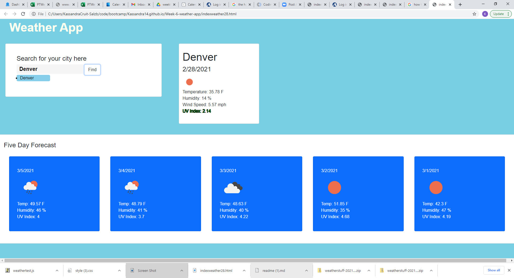

## Weather App

This is a simple weather app- enter the city name in the input field and current weather conditions as well as a 5 day forecast will populate to the cards on side and below.

You can use this app for quick weather condition check possibly if traveling, or just to compare city conditions.

## Built with:
jquery, bootstrap, basic html

## Deployed:

* Repo:
https://github.com/Kassandra14/Kassandra14.github.io
* App:
https://kassandra14.github.io/Week-6-weather-app/indexweather28.html

## Photo:

