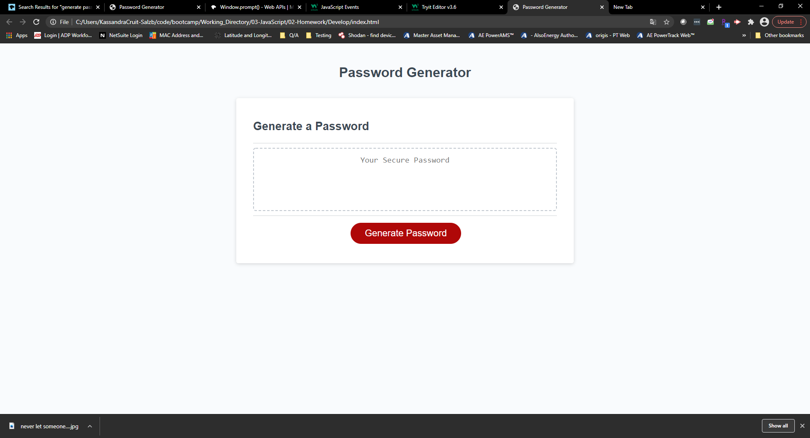

# 03 JavaScript: Password Generator

This is the password generator assignment - should incorporate all of the informatiaon below:

:  Click Generate Password button
:  user selects length of password (between 8 and 128 characters- prompts if input does not match this)
:  series of prompts to determine password contains special characters, uppcase, lowercase and numeric characters
: inputs are saved and sorted through math.random function to gerneate random value of determined length also math.floor function to round to whole number
: when the password is generated it is displayed in the field above the button : see screenshot below:

Application urls:

 https://kassandra14.github.io/password%20generator//Develop/index.html

Repo url:

 https://github.com/Kassandra14/Kassandra14.github.io
 

