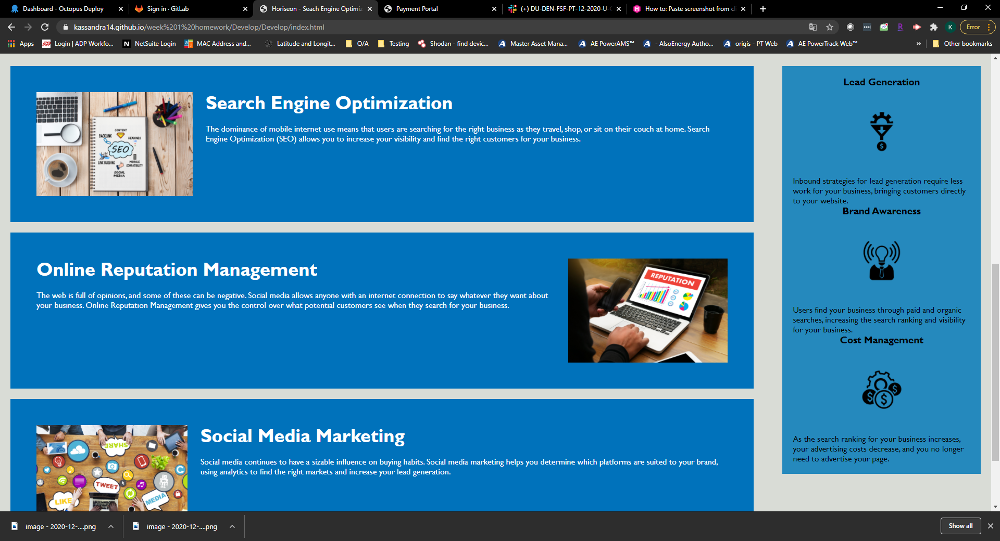

#Project Title - Code refactor 1#

This assignment is to refactor the code for a marketing website using semantic HTML to improve site accessibility and visibility.

Here is a screenshot of the site mock up

Here is a link to the deployed website:

https://kassandra14.github.io/week%201%20homework/Develop/Develop/index.html