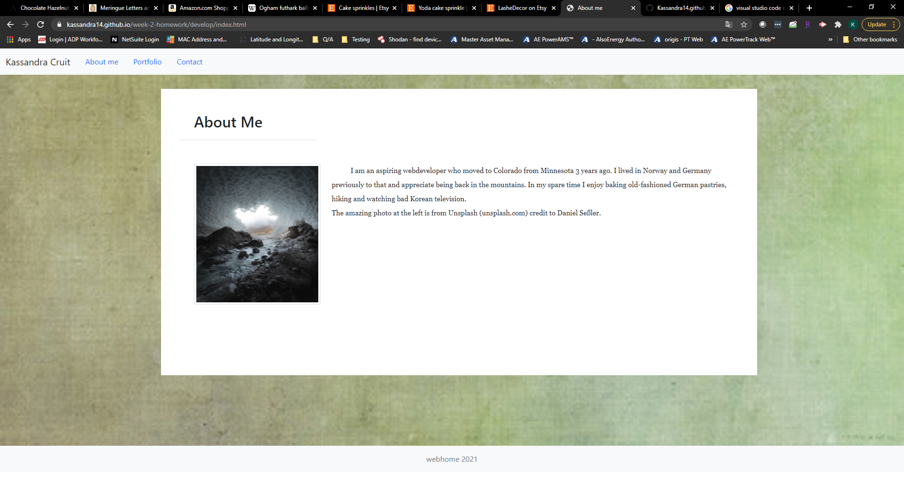

# Unit 02 CSS and Bootstrap Homework: Responsive Portfolio

Responsive design ensures that web applications render well on a variety of devices and window or screen sizes. As a developer, you will likely be asked to create a mobile-first application or add responsive design to an existing application. 

This assignment attempts to incorporate responsive design elements"

Screenshot:

Deployed application:  https://kassandra14.github.io/week-2-homework/develop/index.html

